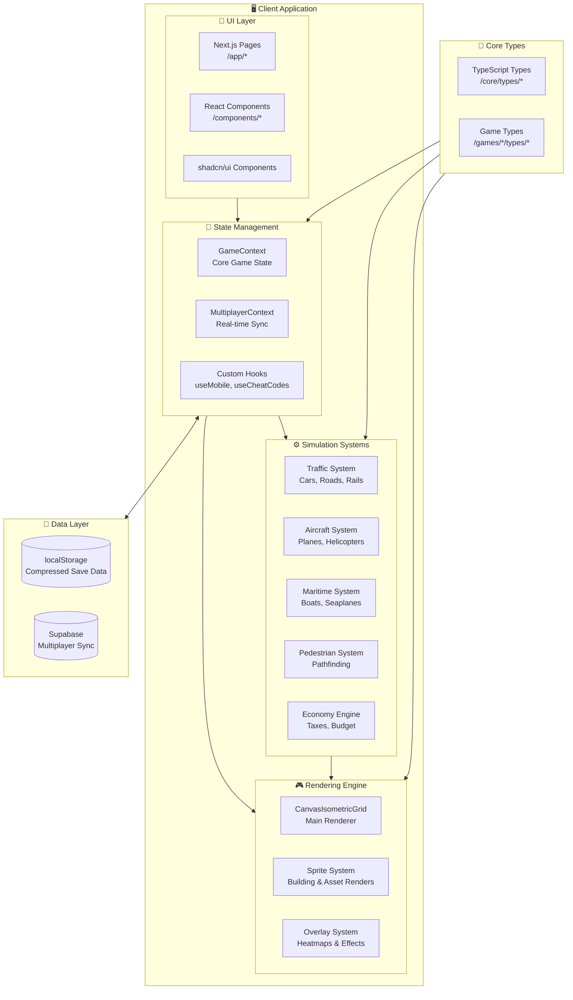

# 🎮 IsoCity & IsoCoaster

[](https://iso-city.com)
[](https://iso-coaster.com)
[](LICENSE)
[](https://nextjs.org/)
[](https://www.typescriptlang.org/)
[](https://react.dev/)

> Open-source isometric simulation games built with **Next.js**, **TypeScript**, and **HTML5 Canvas**. Create thriving cities or build the ultimate theme park!

<table>
<tr>
<td width="50%" align="center"><strong>🏙️ IsoCity</strong></td>
<td width="50%" align="center"><strong>🎢 IsoCoaster</strong></td>
</tr>
<tr>
<td></td>
<td></td>
</tr>
<tr>
<td align="center">City builder with trains, planes, cars, and pedestrians<br><a href="https://iso-city.com">iso-city.com</a></td>
<td align="center">Build theme parks with roller coasters, rides, and guests<br><a href="https://iso-coaster.com">iso-coaster.com</a></td>
</tr>
</table>

Made with [Cursor](https://cursor.com)

---

## ✨ IsoCity Features

### 🎮 Core Gameplay
- **Isometric Rendering Engine**: Custom-built HTML5 Canvas rendering system with complex depth sorting, layer management, and sprite-based graphics
- **Dynamic Simulation**: Real-time city simulation with autonomous systems
- **Tile-based Construction**: Intuitive grid-based placement for buildings, roads, parks, and utilities
- **Save/Load System**: Persistent game state with multiple city slots
- **Responsive Design**: Full mobile support with specialized touch controls

### 🚗 Traffic & Transportation Systems
- **Road Networks**: Smart road merging and intersection logic
- **Railway System**: Complete rail infrastructure with tracks, trains, and stations
- **Aviation**: Airplanes, helicopters, and seaplanes with realistic takeoff/landing dynamics
- **Maritime**: Boats, barges, and seaplane water operations
- **Pedestrian Simulation**: Pathfinding and crowd dynamics for city inhabitants

### 🏗️ Building & Zoning
- **Zoning System**: Residential, Commercial, and Industrial zones with density upgrades
- **50+ Building Types**: From houses to stadiums, airports to space programs
- **Utility Infrastructure**: Power plants, water towers, police/fire stations, schools, hospitals
- **Recreation Facilities**: Parks, sports fields, amusement parks, marinas, and more
- **Terraforming**: Water/land transformation tools for custom terrain

### 💰 Economy & City Management
- **Dynamic Economy**: Tax collection, budget management, and city funding
- **City Statistics**: Population tracking, happiness metrics, and historical data
- **Land Value Simulation**: Dynamic property values based on location and services
- **Service Coverage**: Police, fire, health, and education coverage visualization
- **Multi-city World**: Connect with neighboring cities and discover new regions

### 🌐 Multiplayer
- **Cooperative Play**: Real-time multiplayer city building with friends
- **Room-based Sessions**: Easy join via 5-character room codes
- **Synchronized State**: Live updates across all connected players

---

## ✨ IsoCoaster Features

### 🎢 Theme Park Construction
- **Roller Coaster Builder**: Design custom roller coasters with multiple track types
- **Flat Rides**: Ferris wheels, carousels, and classic amusement rides
- **Theming**: Decorate your park with scenery, paths, and themed areas
- **Guest Simulation**: AI guests with preferences, happiness, and spending behavior

### 🎪 Park Management
- **Financial System**: Ticket prices, ride fees, and concession management
- **Staff Management**: Hire mechanics, janitors, and entertainers
- **Guest Happiness**: Keep visitors satisfied with clean facilities and exciting rides

---

## 🛠️ Tech Stack

| Category | Technology |
|----------|------------|
| **Framework** | [Next.js 16](https://nextjs.org/) with App Router |
| **Language** | [TypeScript](https://www.typescriptlang.org/) (Strict Mode) |
| **UI Library** | [React 19](https://react.dev/) |
| **Styling** | [Tailwind CSS](https://tailwindcss.com/) + [shadcn/ui](https://ui.shadcn.com/) |
| **Components** | [Radix UI](https://www.radix-ui.com/) primitives |
| **Icons** | [Lucide React](https://lucide.dev/) |
| **Graphics** | HTML5 Canvas API (Custom implementation) |
| **State Management** | React Context + Custom Hooks |
| **Persistence** | localStorage + lz-string compression |
| **Multiplayer** | Supabase Real-time |
| **i18n** | [GT Next](https://generaltranslation.com/) |
| **Analytics** | [Vercel Analytics](https://vercel.com/analytics) |

---

## 🏗️ Architecture

### System Overview



### Project Structure

```
isometric-city/
├── src/
│   ├── app/                    # Next.js App Router pages
│   │   ├── page.tsx           # Landing page with game selection
│   │   ├── layout.tsx         # Root layout with providers
│   │   ├── city/              # IsoCity game routes
│   │   ├── coaster/           # IsoCoaster game routes
│   │   └── coop/[roomCode]/   # Multiplayer game rooms
│   │
│   ├── components/
│   │   ├── Game.tsx           # Main game component
│   │   ├── game/              # Shared game components
│   │   │   ├── CanvasIsometricGrid.tsx  # Core renderer
│   │   │   ├── trafficSystem.ts         # Traffic simulation
│   │   │   ├── aircraftSystems.ts       # Aviation logic
│   │   │   └── overlays.ts              # Heatmap overlays
│   │   ├── city/              # IsoCity-specific components
│   │   ├── coaster/           # IsoCoaster-specific components
│   │   ├── ui/                # shadcn/ui components
│   │   └── multiplayer/       # Multiplayer components
│   │
│   ├── context/
│   │   ├── GameContext.tsx    # Core game state management
│   │   └── MultiplayerContext.tsx  # Real-time multiplayer
│   │
│   ├── core/
│   │   └── types/             # Shared type definitions
│   │
│   ├── games/
│   │   ├── isocity/           # IsoCity game logic & types
│   │   └── isocoaster/        # IsoCoaster game logic & types
│   │
│   ├── hooks/                 # Custom React hooks
│   └── lib/                   # Utilities & simulation engines
│
├── public/
│   └── assets/                # Game sprites and images
│
└── scripts/                   # Build & utility scripts
```

---

## 🚀 Getting Started

### Prerequisites

- **Node.js**: v18 or higher (v22 recommended)
- **npm**: v9 or higher

### Installation

1. **Clone the repository:**
   ```bash
   git clone https://github.com/amilich/isometric-city.git
   cd isometric-city
   ```

2. **Install dependencies:**
   ```bash
   npm install
   ```

3. **Run the development server:**
   ```bash
   npm run dev
   ```

4. **Open the game:**
   Visit [http://localhost:3000](http://localhost:3000) in your browser.

### Build for Production

```bash
npm run build
```

### Lint Code

```bash
npm run lint
```

---

## 📖 Usage Guide

### IsoCity - City Building

1. Visit the homepage and select **"Play IsoCity"**
2. Your city starts with a default grid size (50x50 mobile, 70x70 desktop)
3. Begin by zoning Residential, Commercial, and Industrial areas
4. Connect zones with roads
5. Place essential services: Power Plant, Water Tower

#### Available Tools

**Infrastructure:**
- 🛣️ Road - Connect your city ($25)
- 🚃 Rail - Railway tracks ($40)
- 🚇 Subway - Underground transit ($50)

**Zoning:**
- 🏠 Residential - Housing zones ($50)
- 🏢 Commercial - Shops and offices ($50)
- 🏭 Industrial - Factories ($50)

**Services:**
- 🚔 Police Station, 🚒 Fire Station, 🏥 Hospital, 🏫 School/University
- ⚡ Power Plant, 💧 Water Tower
- 🌳 Parks, 🏟️ Stadium, ✈️ Airport, 🚀 Space Program

### IsoCoaster - Theme Park

1. Visit the homepage and select **"Play IsoCoaster"**
2. Start with an empty plot of land
3. Build roller coasters using the track builder
4. Add flat rides and amenities
5. Open your park to guests

### Multiplayer (IsoCity)

1. Click **"Co-op"** on the homepage
2. Choose **"Create Room"** to host or enter a room code to join
3. Share the 5-character room code with friends
4. Build together in real-time!

---

## ⚙️ Environment Variables

The application uses the following environment variables (all optional for local development):

| Variable | Description | Required |
|----------|-------------|----------|
| `NEXT_PUBLIC_SUPABASE_URL` | Supabase project URL | For multiplayer |
| `NEXT_PUBLIC_SUPABASE_ANON_KEY` | Supabase anonymous key | For multiplayer |
| `NEXT_PUBLIC_GT_API_KEY` | GT Translate API key | For i18n |
| `NEXT_PUBLIC_GT_PROJECT_ID` | GT Translate project ID | For i18n |

Create a `.env.local` file for local development:

```bash
# Optional: Enable multiplayer features
NEXT_PUBLIC_SUPABASE_URL=your_supabase_url
NEXT_PUBLIC_SUPABASE_ANON_KEY=your_supabase_anon_key
```

---

## 🧪 Development

### Project Commands

```bash
# Development
npm run dev          # Start dev server with Turbopack

# Building
npm run build        # Production build with image compression
npm run start        # Start production server

# Code Quality
npm run lint         # Run ESLint
npm run crop-screenshots    # Process screenshots
npm run compress-images     # Optimize game assets
```

### Key Architectural Decisions

1. **Canvas-based Rendering**: Uses HTML5 Canvas API directly instead of a game engine for maximum control and performance
2. **React Context for State**: Centralized state management with GameContext for the game loop
3. **Custom Hooks**: Business logic extracted into reusable hooks (useMobile, useCheatCodes, etc.)
4. **Web Workers for Save/Load**: Compression/decompression offloaded to avoid blocking the main thread
5. **lz-string Compression**: Efficient localStorage usage for large city saves
6. **Modular Simulation Systems**: Traffic, aircraft, pedestrians as separate modules

---

## 🤝 Contributing

Contributions are welcome! Here's how to get started:

1. **Fork the repository**
2. **Create a feature branch:**
   ```bash
   git checkout -b feature/my-new-feature
   ```
3. **Make your changes**
4. **Run linting:**
   ```bash
   npm run lint
   ```
5. **Commit your changes:**
   ```bash
   git commit -m "feat: add new feature"
   ```
6. **Push to your fork:**
   ```bash
   git push origin feature/my-new-feature
   ```
7. **Open a Pull Request**

### Code Style

- TypeScript with strict mode enabled
- Use `@/*` path alias for imports
- React functional components with `'use client'` directive when needed
- Follow existing ESLint configuration

---

## 📄 License

Distributed under the MIT License. See [LICENSE](LICENSE) for more information.

```
MIT License

Copyright (c) 2025 amilich

Permission is hereby granted, free of charge, to any person obtaining a copy
of this software and associated documentation files (the "Software"), to deal
in the Software without restriction, including without limitation the rights
to use, copy, modify, merge, publish, distribute, sublicense, and/or sell
copies of the Software, and to permit persons to whom the Software is
furnished to do so, subject to the following conditions:

The above copyright notice and this permission notice shall be included in all
copies or substantial portions of the Software.
```

---

## 🙏 Acknowledgments

- Built with [Cursor](https://cursor.com) - The AI-first code editor
- UI components from [shadcn/ui](https://ui.shadcn.com/)
- Icons by [Lucide](https://lucide.dev/)
- Multiplayer powered by [Supabase](https://supabase.com/)

---

## 🔗 Links

- **IsoCity**: [iso-city.com](https://iso-city.com)
- **IsoCoaster**: [iso-coaster.com](https://iso-coaster.com)
- **Repository**: [github.com/amilich/isometric-city](https://github.com/amilich/isometric-city)
- **Issues**: [GitHub Issues](https://github.com/amilich/isometric-city/issues)

---

<p align="center">
  Made with ❤️ for simulation game enthusiasts everywhere
</p>
