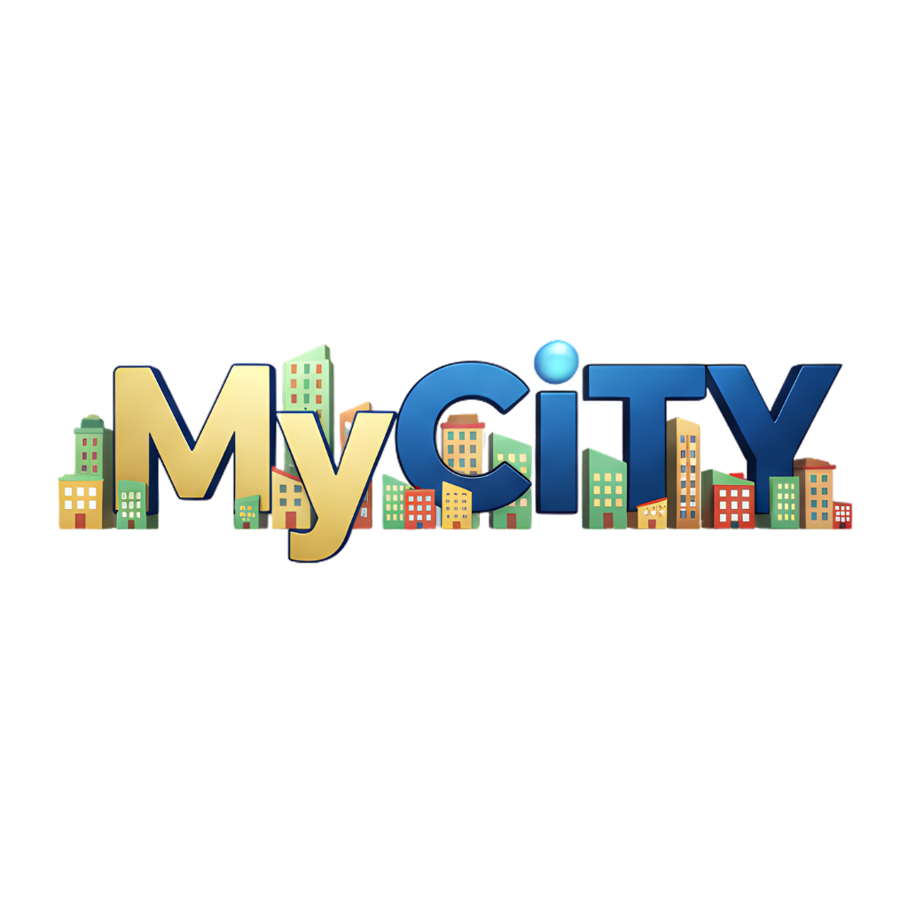
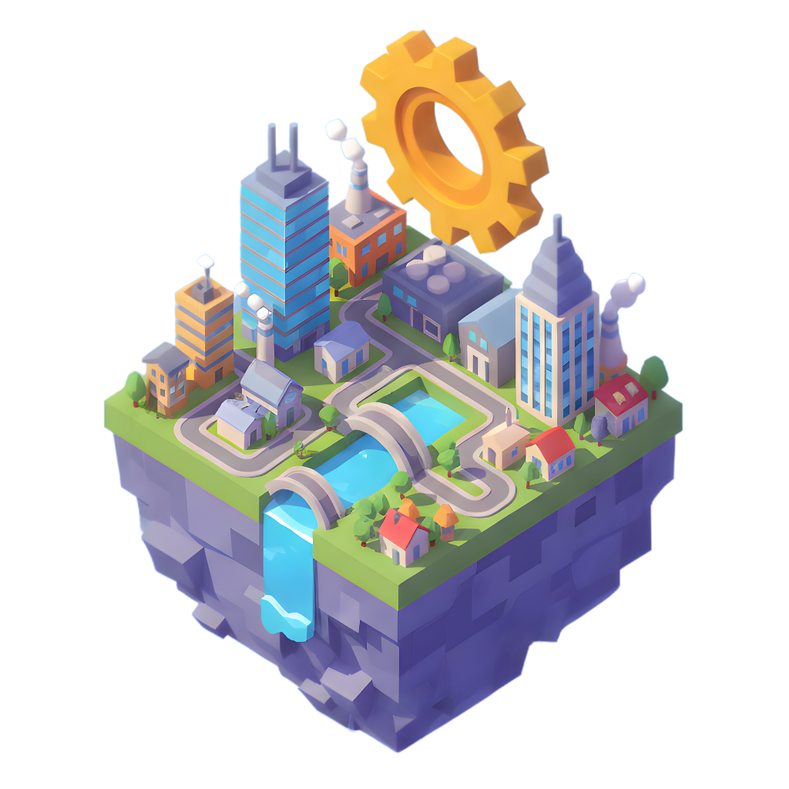

# Truncgil MyCity



Modern web teknolojileri ile geliştirilmiş, tarayıcıda çalışan, yüksek performanslı ve açık kaynaklı bir izometrik şehir kurma simülasyonu. **Truncgil MyCity**, kendi yaşayan şehrinizi inşa etmeniz, yönetmeniz ve büyütmeniz için size sınırsız bir özgürlük sunar.

## 🏙️ Oyun Hakkında

Truncgil MyCity, klasik şehir kurma oyunlarının ruhunu modern web'in gücüyle birleştirir. **Next.js**, **TypeScript** ve **Tailwind CSS** altyapısı üzerinde, HTML5 Canvas API kullanılarak sıfırdan geliştirilmiş özel bir rendering motoruna sahiptir. Bu sayede, herhangi bir harici oyun motoruna ihtiyaç duymadan, doğrudan tarayıcınızda akıcı, detaylı ve canlı bir şehir simülasyonu deneyimi yaşatır.

Oyun, sadece binaları yerleştirmekten ibaret değildir; şehriniz yaşayan bir organizmadır:
*   **Canlı Trafik**: Araçlar yollarda gerçek zamanlı olarak hareket eder, trafik sıkışıklıkları oluşabilir.
*   **Dinamik Ekonomi**: Vergi oranları, bütçe yönetimi ve hizmet maliyetleri şehrinizin kaderini belirler.
*   **Gelişmiş Zonlama**: Konut, ticari ve endüstriyel alanlar birbirleriyle etkileşim içindedir.
*   **Detaylı Grafikler**: Piksel sanatı tarzında hazırlanmış yüzlerce benzersiz bina ve çevre elementi ile görsel bir şölen sunar.

## ✨ Temel Özellikler

### 🏗️ İnşaat ve Şehir Planlama
Kendi hayalinizdeki şehri kurmak için geniş bir araç setine sahipsiniz:
- **İzometrik Görselleştirme**: Derinlik hissi veren, detaylı çizimler ve katmanlı rendering sistemi.
- **Kapsamlı Bina Kataloğu**:
  - **Konutlar**: Müstakil evlerden gökdelenlere uzanan yaşam alanları.
  - **Ticaret Merkezleri**: Küçük dükkanlar, ofis kuleleri ve AVM'ler.
  - **Sanayi Tesisleri**: Fabrikalar, depolar ve üretim merkezleri.
  - **Hizmet Binaları**: Okullar, hastaneler, polis ve itfaiye merkezleri.
  - **İkonik Yapılar**: Stadyumlar, havalimanları, parklar ve anıtlar.

### 🚗 Gelişmiş Ulaşım Ağı
Şehrinizin damarları olan ulaşım sistemini yönetin:
- **Kara Yolu**: Farklı yol tipleri, kavşaklar ve otonom araç trafiği.
- **Raylı Sistemler**: Metro, tramvay ve tren hatları ile toplu taşıma çözümleri.
- **Hava ve Deniz**: Havalimanları, uçaklar, limanlar ve deniz araçları ile şehrinizi dünyaya bağlayın.
- **Yaya Simülasyonu**: Sokaklarda yürüyen vatandaşlar ve kalabalık yönetimi.

### 💰 Ekonomi ve Yönetim Simülasyonu
Gerçekçi bir belediye başkanlığı deneyimi:
- **Bütçe Kontrolü**: Gelir-gider dengesi, vergi ayarlamaları ve finansal raporlar.
- **Kaynak Yönetimi**: Elektrik şebekesi, su tesisatı ve altyapı hizmetleri.
- **Şehir İstatistikleri**: Nüfus artışı, istihdam, mutluluk oranı ve suç istatistikleri takibi.
- **Danışman Sistemi**: Şehrinizin ihtiyaçları konusunda sizi uyaran akıllı asistanlar.

### 🎯 Oynanış Dinamikleri
- **Akıllı Bölgelendirme**: RCI (Residential, Commercial, Industrial) dengesini kurun.
- **Talep Döngüsü**: Vatandaşların ihtiyaçlarına göre değişen dinamik talep sistemi.
- **Hizmet Kapsama Alanları**: İtfaiye, polis ve sağlık hizmetlerinin erişilebilirliğini optimize edin.
- **Çoklu Şehir Desteği**: Farklı şehir projelerini kaydedin ve yönetin.
- **Zaman Akışı**: Gece-gündüz döngüsü ve ayarlanabilir oyun hızı.

## 📱 Kullanıcı Arayüzü ve Deneyim
- **Responsive Tasarım**: Hem masaüstü hem de mobil cihazlarda kusursuz çalışır.
- **Dokunmatik Kontroller**: Tablet ve telefonlar için optimize edilmiş dokunmatik arayüz.
- **İnteraktif Mini Harita**: Şehrinize kuş bakışı hakim olun.
- **Bilgi Katmanları (Overlays)**: Trafik yoğunluğu, kirlilik, arazi değeri gibi verileri harita üzerinde görselleştirin.
- **Çoklu Dil**: Türkçe ve İngilizce dil desteği ile global erişim.

## 🛠️ Teknoloji Yığını

Bu proje, modern web geliştirme ekosisteminin en güçlü araçları kullanılarak inşa edilmiştir:

### Çerçeve ve Dil
- **[Next.js 16+](https://nextjs.org/)**: App Router mimarisi ile güçlü ve esnek bir altyapı.
- **[TypeScript](https://www.typescriptlang.org/)**: Tip güvenliği ile hatasız ve sürdürülebilir kod tabanı.
- **[React 19](https://react.dev/)**: Modern UI bileşenleri ve durum yönetimi.

### Stil ve Görünüm
- **[Tailwind CSS](https://tailwindcss.com/)**: Hızlı ve özelleştirilebilir stil tanımları.
- **[shadcn/ui](https://ui.shadcn.com/)** & **[Radix UI](https://www.radix-ui.com/)**: Erişilebilir ve şık arayüz bileşenleri.
- **[Lucide React](https://lucide.dev/)**: Tutarlı ve modern ikon seti.

### Grafik Motoru
- **HTML5 Canvas API**: Performanslı, özel yazılmış izometrik çizim motoru.
- **Custom Sprite System**: Optimize edilmiş varlık yönetimi ve çizim hattı.

### Yardımcı Araçlar
- **next-intl**: Uluslararasılaştırma ve yerelleştirme.
- **lz-string**: Kayıt dosyaları için veri sıkıştırma.
- **Vercel Analytics**: Kullanıcı deneyimi analitiği.

## 📂 Proje Yapısı

Proje, genişletilebilir ve modüler bir mimari ile tasarlanmıştır:

```
mycity/
├── public/                      # Görsel varlıklar ve ikonlar
├── src/
│   ├── app/                     # Next.js App Router ve Sayfalar
│   ├── components/              # React Bileşenleri
│   │   ├── game/                # 🎮 OYUN MOTORU BİLEŞENLERİ
│   │   │   ├── panels/          # Oyun panelleri (Ayarlar, Bütçe vb.)
│   │   │   ├── systems/         # Trafik, yolcu, bina render sistemleri
│   │   │   └── ui/              # Oyun içi arayüzler
│   ├── lib/                     # Yardımcı kütüphaneler
│   │   ├── simulation/          # 🧠 SİMÜLASYON MOTORU (Detaylar aşağıda)
│   │   │   ├── core.ts          # Ana oyun döngüsü ve state yönetimi
│   │   │   ├── economy.ts       # Ekonomi, bütçe ve talep hesaplamaları
│   │   │   ├── buildings.ts     # Bina gelişimi ve inşaat mantığı
│   │   │   ├── terrain.ts       # Harita üretimi (Perlin noise)
│   │   │   ├── services.ts      # Altyapı ve kapsama alanı
│   │   │   └── ...
│   ├── context/                 # Global oyun durumu (State Management)
│   ├── hooks/                   # Özel React Hook'ları
│   └── types/                   # TypeScript tip tanımları
└── ...
```

### 🧠 Simülasyon Motoru (`src/lib/simulation`)

Oyunun kalbi olan simülasyon motoru, monolitik bir yapıdan modüler, yönetilebilir ve test edilebilir bir mimariye dönüştürülmüştür. Bu motor, şehrin her bir nefesini kontrol eder.

**Temel Modüller:**

*   **`constants.ts`**: Oyun içi sabitler, bina türleri, konfigürasyonlar ve statik veriler.
*   **`factories.ts`**: Oyun nesnelerini (Tile, Building, GameState) oluşturmak için kullanılan fabrika fonksiyonları.
*   **`utils.ts`**: Genel yardımcı fonksiyonlar (UUID oluşturma, matematiksel hesaplamalar vb.).
*   **`index.ts`**: Tüm modülleri dışa aktaran ana giriş noktası.
*   **`terrain.ts`**: Harita üretimi (Perlin noise), göller, okyanuslar ve komşu şehirlerin oluşturulması.
*   **`services.ts`**: Elektrik, su, polis, itfaiye gibi hizmetlerin kapsama alanı hesaplamaları.
*   **`core.ts`**: Oyunun kalbi. `createInitialGameState` (başlatma) ve `simulateTick` (ana döngü) fonksiyonlarını içerir.
*   **`actions.ts`**: Kullanıcı etkileşimleri. Bina yerleştirme, yıkma, metro hattı çekme gibi eylemler.
*   **`buildings.ts`**: Binaların gelişimi, inşaat süreçleri, birleşme (consolidation) mantığı ve yol erişimi kontrolleri.
*   **`economy.ts`**: Bütçe, vergiler, şehir istatistikleri (nüfus, mutluluk vb.) ve talep hesaplamaları.
*   **`advisors.ts`**: Oyuncuya gösterilecek uyarılar ve tavsiyeler.

**Çalışma Prensibi (The Simulation Loop):**

Oyun döngüsü (`simulateTick`), belirli aralıklarla (tick) çalışır ve oyun durumunu (`GameState`) günceller. Döngü şu adımları izler:

1.  **Hizmet Hesaplama (`calculateServiceCoverage`)**:
    *   Tüm servis binalarının (polis, elektrik santrali vb.) etki alanları hesaplanır.
    *   Bu, her kare (`Tile`) için hizmet durumunu belirler.

2.  **Kare İşleme (Tile Processing)**:
    *   Haritadaki her kare tek tek gezilir.
    *   **Altyapı**: Elektrik ve su durumu güncellenir.
    *   **İnşaat**: İnşaatı devam eden binalar ilerletilir.
    *   **Gelişim (`evolveBuilding`)**: Konut, ticari ve endüstriyel bölgelerdeki binalar; talep, çevre koşulları ve hizmetlere göre seviye atlar veya terk edilir.
    *   **Afetler**: Yangın vb. durumlar simüle edilir.

3.  **Ekonomi ve İstatistikler (`calculateStats`)**:
    *   Nüfus, iş imkanları, kirlilik ve diğer istatistikler toplanır.
    *   Vergi oranlarına ve şehir durumuna göre yeni talepler (`demand`) hesaplanır.
    *   Gelir ve giderler bütçeye işlenir.

4.  **Zaman ve Olaylar**:
    *   Oyun saati ve tarihi ilerletilir.
    *   Belirli aralıklarla danışman mesajları (`advisorMessages`) oluşturulur.
    *   Geçmiş veriler (`history`) güncellenir.

## 🚀 Kurulum ve Başlatma

Kendi şehrinizi yerel makinenizde kurmak için aşağıdaki adımları izleyin:

### Gereksinimler
- **Node.js**: v18 veya üzeri
- **npm**: v9 veya üzeri

### Adım Adım Kurulum

1.  **Projeyi Klonlayın:**
    ```bash
    git clone https://github.com/truncgil/mycity.git
    cd mycity
    ```

2.  **Bağımlılıkları Yükleyin:**
    ```bash
    npm install
    ```

3.  **Geliştirme Sunucusunu Başlatın:**
    ```bash
    npm run dev
    ```

4.  **Oyuna Başlayın:**
    Tarayıcınızda [http://localhost:3000](http://localhost:3000) adresine gidin.

## 🤝 Katkıda Bulunma

Truncgil MyCity açık kaynaklı bir projedir ve topluluk katkılarıyla büyür. Hata bildirimleri, yeni özellik önerileri veya kod katkılarınız bizim için değerlidir. GitHub Issues üzerinden iletişime geçebilir veya Pull Request gönderebilirsiniz.

## 📝 Lisans

Bu proje **MIT Lisansı** ile lisanslanmıştır. Özgürce kullanabilir, değiştirebilir ve dağıtabilirsiniz.

---

<div align="center">
  
  <h3>Truncgil MyCity</h3>
  <p>Şehrini Kur, Yönet, Yaşat!</p>
</div>
